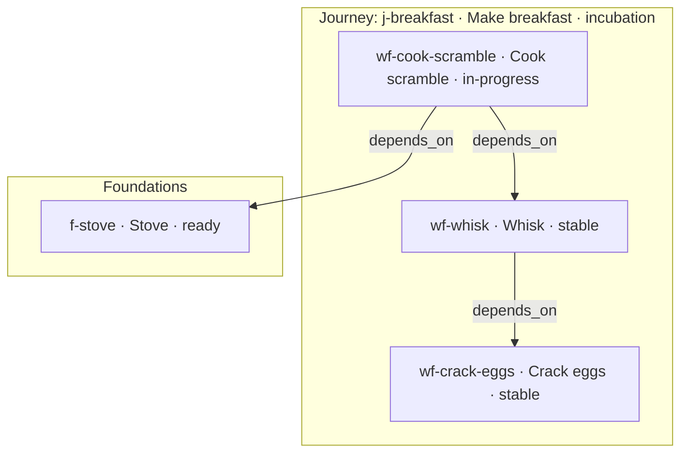

# MindPlan

**MindPlan is the product plan AI agents work from.**  
Software cannot be written without knowing what the system is. MindPlan keeps that knowledge in the repo — capabilities, infrastructure, dependencies, and what's allowed to ship — so agents build against a real model of the project instead of guessing from tickets and chat.

Plan state lives next to the code. Every change to it is checked; illegal moves are rejected.

## The problem

How can AI agents write software if they do not know what the project is about? Without a durable model of the product — what capabilities exist, what infrastructure is ready, what is legal to build next — agents improvise from chat history and stale tickets. They build on unfinished plumbing, ship over unstable dependencies, or mark work done while checklist items are still open.

External trackers (Jira, Linear, GitHub Projects) do not fix that: they list intent, but they do not give agents a living picture of the system, and nothing refuses an illegal move when the ticket says "ship."

## A plan that can refuse

Traditional issue trackers answer: *what should someone work on?*

MindPlan answers:

- What **is** this project — which capabilities and infrastructure exist?
- What **can** be worked on next?
- Is this change **architecturally valid**?
- What will this **break**?
- Is this feature even **allowed to ship**?

That plan is not advisory. Every mutation is validated like a compile step for planning — guardrails reject violations with a machine-parsable error:

```
Blocked: Infrastructure First. Workflow "wf-checkout" cannot ship while
linked Foundations or Workflows are not stable: "f-payments" (in-progress).
```

No ghost workflows without a capability and foundation, no shipping on unstable deps, no review while Atomic Ops are unchecked. Agents get a focus node, its links, and blast radius *before* they touch code — not after something breaks.

## Plans are made to be changed

Every constraint and dependency is an engineering decision — and decisions change. MindPlan's compiler refuses *illegal* moves; it does not freeze the plan.

You change the graph under the rules:

- **Rewire** — `link_nodes` / `unlink_nodes` when dependencies or Journey membership shift
- **Retreat** — move `in-review` back to `in-progress` when scope or checklist reality changes
- **Evolve** — shipped Foundations and Workflows keep the same id forever; `open_next` opens a `next.mdx` draft, you run the build pipeline against it, and `ship` promotes it over `current.mdx`
- **Retire** — move production work to `deprecated` when intent is replaced (Journeys stay; only Bugs truly close)

In traditional trackers, shipping often means closing the ticket and losing it from the living map. MindPlan keeps Journeys permanent and Workflows as live product surface: evolve in place, or deprecate — don't pretend "done" erased the capability.

## See what the agent sees

After every graph mutation, MindPlan refreshes [`mindplan/map.md`](mindplan/map.md) — a Mermaid diagram of Journeys, Foundations, Workflows, and Bugs. Node labels include delivery state (`id · title · state`), so you can scan what is stable, in flight, or blocked by dependencies the same way an agent does via MCP.

On demand:

- MCP `export_mindplan_view` — Mermaid or DOT (full map or focus + 1-hop)
- CLI `mindplan-mcp view` — same projection from the terminal

Today's map is an **architecture + state** projection, not a kanban board. A richer **status board** (done / in-flight / blocked at a glance) is planned; until then, open `map.md` on GitHub or run `view` to read the same graph the tools expose.

## Worked example: scrambled eggs

Imagine planning breakfast the way you'd plan a product. Capability, shared stove, and use cases — with states you can see.



Arrows are MindPlan `depends_on` (dependent → dependency), same as `map.md` — not cooking-step order.

- **Journey** `j-breakfast` — permanent capability ("Make breakfast"), not a sprint
- **Foundation** `f-stove` — shared substrate; cook cannot ship until the stove is `stable`
- **Workflows**
  - `wf-crack-eggs` — no Workflow deps in this sketch
  - `wf-whisk` — `depends_on` `wf-crack-eggs` (you whisk what you cracked)
  - `wf-cook-scramble` — the cooking Workflow; `depends_on` `wf-whisk` and `f-stove`

Trying to ship `wf-cook-scramble` while `f-stove` is still `ready` fails:

```
Blocked: Infrastructure First. Workflow "wf-cook-scramble" cannot ship while
linked Foundations or Workflows are not stable: "f-stove" (ready).
```

When the plan changes — say you add toast that also needs the stove — you don't fight the compiler: create `wf-make-toast`, `link_nodes` it to `j-breakfast` and `f-stove`, and keep going. When the scramble recipe itself changes after ship, `open_next` on `wf-cook-scramble` (same id) and evolve under `next.mdx`.

Snapshot in the diagram: crack and whisk are done (`stable`); cook is underway; stove isn't shippable infrastructure yet — so cook is blocked from shipping until you finish the foundation.

## How it's built

Plan state lives in the repository as `current.mdx` files under `mindplan/` (Journeys, Foundations, Workflows, Bugs) — plus an optional `next.mdx` next to a shipped Foundation's or Workflow's `current.mdx` while it evolves in place. Node ids are stable forever: there is no new id for a revision. Workflow and Foundation nodes also own prescribed implementation packages under `src/workflows/<id>/` and `src/foundations/<id>/`. An MCP server is the single write path for plan mutations; it validates against architectural rules and exposes a queryable graph plus `get_node_implementation` so agents can inspect software architecture, not only delivery state.

- **[SPEC.md](SPEC.md)** — full framework specification (taxonomy, state machines, compiler rules, file formats, tool contract)
- **`src/`** — TypeScript MCP server (stdio transport)

## This repo's live plan

This repository dogfoods MindPlan. Live territory: [`mindplan/`](mindplan/). The auto-generated map is at [mindplan/map.md](mindplan/map.md).

## Who is this for

MindPlan is built for people who ship **with AI agents** and need those agents to know what the project is — a living product plan, not a stale ticket list.

It works best for **indie developers and small, tightly collaborating teams**. Plan state is plain-text `current.mdx` / `next.mdx` in git, so concurrency follows git — the same way two people build two features on different files.

That is a good fit when:

- You're a solo builder, or a small team where agents and humans often work on **different** Workflows or Foundations in parallel (merge conflicts stay rare, like distinct feature work)
- You want planning and code to live and merge together
- Your agents need a queryable source of truth that can refuse illegal moves

The real limit is concurrent edits to the **same** node's frontmatter (state, edges) — that can produce ordinary git conflicts the rules engine does not resolve for you. MCP is the write gate and validator, not a multi-writer lock; the system does not "crash" under collaboration.

It's a poor fit today for:

- Organizations that need multi-user permissions, audit trails, or sync with existing PM tools (Jira, Linear, GitHub Projects) — MindPlan intentionally has no external sync
- Teams that expect a shared live board with locking instead of git-based merges

## Quick start

**Not yet published to npm — install from source.**

1. Clone and build the server:

```bash
git clone https://github.com/nbiro/mindplan.git
cd mindplan
npm install && npm run build
```

2. From your project's root directory, run `init` against the built server to scaffold `mindplan/` and install agent instructions:

```bash
node /absolute/path/to/mindplan/dist/index.js init
```

`init` uses the current working directory as the project root (override with `MINDPLAN_ROOT`) and installs:

- `.cursorignore` — blocks agent file tools from reading territory; agents use MCP for reads and `patch_node_territory` for writes
- `mindplan/agent/playbook.md` — always-on SDLC execution process for all software work
- `mindplan/agent/skills/define-entities/` — guide for defining Journey, Foundation, Workflow, and Bug nodes
- `mindplan/agent/mcp.json.example` — MCP server config snippet
- `mindplan/agent/integrations/` — setup guides for Cursor, Claude Code, Copilot, Windsurf, Cline, Continue, and generic MCP clients
- `AGENTS.md` at the project root — created only when missing (many agents auto-read this file)

3. Register the MCP server with your coding agent — pick the guide that matches your tool:

```
mindplan/agent/integrations/
```

See [integrations README](templates/agent/integrations/README.md) in this repo for the full list.

4. Reload MCP servers in your agent after config changes.

## File system layout (consumer project)

```
<project-root>/
├── AGENTS.md                        # Agent instructions (optional; created by init when missing)
├── mindplan/
│   ├── agent/                       # Agent integration assets (installed by init)
│   │   ├── playbook.md
│   │   ├── mcp.json.example
│   │   ├── integrations/            # Per-agent MCP setup guides
│   │   └── skills/
│   │       └── define-entities/
│   ├── components/                # Project-specific MDX components (optional)
│   ├── journeys/<id>/             # Plan only — no src/ package
│   │   ├── current.mdx
│   │   └── attachments/
│   ├── foundations/<id>/
│   │   ├── current.mdx
│   │   ├── next.mdx              # optional — in-flight evolution of a shipped Foundation
│   │   └── attachments/
│   ├── workflows/<id>/
│   │   ├── current.mdx
│   │   ├── next.mdx              # optional — in-flight evolution of a shipped Workflow
│   │   └── attachments/
│   └── bugs/<id>/
│       ├── current.mdx           # Repro, expected/actual, fix checklist
│       └── attachments/
└── src/
    ├── workflows/<workflow-id>/   # Use-case implementation package (scaffolded by create_node)
    └── foundations/<foundation-id>/  # Substrate implementation package
```

Territory files are MDX. Node records and outgoing edge arrays (`belongs_to`, `depends_on`, `affects`) live in YAML frontmatter. A node's id never changes — `next.mdx` holds a draft evolution of a shipped Foundation/Workflow under the same id; `ship` promotes it over `current.mdx`. Implementation packages are prescribed by type+id (`src/workflows/<id>`, `src/foundations/<id>`); Journeys have no code package because Workflows may belong to many Journeys. See SPEC.md §1.2, §6.1 and §7.

## Taxonomy

| Type | What it is | States |
|------|------------|--------|
| **Journey** | A named domain capability the architecture should scream (e.g. "Table ordering", "Billing"). Not an epic, sprint, or tech layer — a permanent container for related use cases. | Computed (`draft`, `incubation`, `stable`, `evolving`) |
| **Foundation** | Shared substrate with no standalone use case: infra *and* reusable product platform (e.g. auth, DB schema, design system, primary button). Workflows depend on it; must be stable before those Workflows can ship. | Build pipeline + computed production (`stable` / `unstable`) |
| **Workflow** | A concrete use case (e.g. "Split the check", "User picker", "Character editor"). May belong to one or more Journeys; may depend on Foundations and other Workflows. | Build pipeline + computed production (`stable` / `unstable`) |
| **Bug** | A defect on a Workflow or Foundation. The only type with a real closed end (`resolved` / `wontfix`). | Dedicated: `open → triaged → fixing → in-review → resolved \| wontfix` |

Journeys scream the domain · Workflows are the use cases · Foundations are the shared substrate.

**Build pipeline** (Foundation/Workflow): `draft → ready → in-progress → in-review → ship` (sets `shipped_at`, computes `stable` or `unstable`).

**Production posture** (`stable` / `unstable`) is computed from open Bugs via `affects` edges — never set manually. Open bug = `open`, `triaged`, `fixing`, or `in-review`.

In traditional trackers, epics close when a milestone ships — then drop out of the living product map even though the same flows keep getting developed. MindPlan doesn't do that: Journeys stay permanent and move between `incubation`, `stable`, and `evolving`; Workflows stay `stable`/`unstable` and evolve in place (`open_next` → `next.mdx` → `ship` promotes it over `current.mdx`, same id) instead of closing. Only Bugs close.

## Compiler Rules

Every violation throws an error starting with `Blocked: `.

1. **No Ghost Workflows** — Workflow cannot reach `ready`/`in-progress` without at least one `belongs_to` + at least one `depends_on`.
2. **No Ghost Bugs** — Bug cannot reach `triaged`/`fixing` without at least one `affects` edge.
3. **Infrastructure First** — Workflow cannot `ship` unless all linked Foundations and Workflows are `stable`.
4. **Completion Check** — unchecked `[ ]` in `current.mdx` (or `next.mdx` while evolving) block `in-review`, `ship`, and Bug `in-review`/`resolved`.
5. **Computed Journey States** — from shipped + in-progress Workflows only; Bugs do not affect Journeys.
6. **Computed Stability** — shipped nodes flip `stable` ↔ `unstable` when open Bugs are linked, unlinked, or resolved.
7. **Taxonomy Enforcement** — edge creation must use a legal shape/type pairing, no self-links or duplicates, no `depends_on` cycles.
8. **Dependency Closure** — linking a Workflow to a Journey is rejected when transitively depended-on Workflows are not already in that Journey; pass `link_dependent: true` to auto-link them.
9. **Next Evolution** — only shipped (`stable`/`unstable`) Foundations/Workflows can `open_next`; blocked while a `next.mdx` is already open. `ship` from next `in-review` promotes `next.mdx` over `current.mdx` in place — same id, no new node.

## MCP Tools

| Tool | Kind | Description |
|------|------|-------------|
| `find_related_nodes` | read | Rank nodes by text query; return focus + 1-hop linked neighborhood (summaries) |
| `orient_for_work` | read | Composite: find_related_nodes + context (record+body) + blast radius for Foundation/Workflow focus |
| `get_mindplan_graph` | read | Nodes and edges assembled from territory frontmatter |
| `export_mindplan_view` | read | Mermaid or DOT typed-DAG projection (full map or focus + 1-hop) |
| `get_blast_radius` | read | Transitive dependents of a node (reverse depends_on); journeys_at_risk |
| `get_node_context` | read | Returns `record`, `body`, attachment paths, and `next` slot when evolving; `raw_context` deprecated |
| `get_node_implementation` | read | Prescribed package for Workflow/Foundation (`src/workflows/<id>` or `src/foundations/<id>`) |
| `patch_node_territory` | mutation | Body edits, checkboxes, title/description; defaults to `next` when evolving a shipped Foundation/Workflow |
| `create_node` | mutation | Creates Journey, Foundation, Workflow, or Bug folder + `current.mdx` |
| `open_next` | mutation | Opens `next.mdx` on a shipped Foundation/Workflow (same id) seeded from `current.mdx`; live node keeps serving unchanged |
| `discard_next` | mutation | Deletes `next.mdx` (and `next-attachments/`), abandoning an in-flight evolution; `current.mdx` unchanged |
| `link_nodes` | mutation | `belongs_to`, `depends_on` (Foundation or Workflow), or `affects`; optional `link_dependent` for journey closure; writes to `next` slot while one is open, otherwise source-node frontmatter; recomputes Journey + stability |
| `unlink_nodes` | mutation | Removes edge(s) from source-node frontmatter (current and next); recomputes Journey + stability |
| `update_node_status` | mutation | Transitions + `ship`; applies to the `next` slot while one is open; ship promotes `next.mdx` over `current.mdx` in place; recomputes stability and Journey states |

## CLI

| Command | Description |
|---------|-------------|
| `mindplan-mcp` | Start the MCP server (stdio) |
| `mindplan-mcp init` | Scaffold `mindplan/`, agent playbook, skills, integrations, `.cursorignore`, and `AGENTS.md` |
| `mindplan-mcp view` | Print a Mermaid/DOT projection of the territory graph (`export` is an alias) |
| `mindplan-mcp help` | Show usage |

`view` options: `--format mermaid|dot`, `--focus <node-id>`, `--include-retired`, `--output <file>`.

Set `MINDPLAN_ROOT` to override the project root (defaults to `process.cwd()`).

Graph views are read-only projections of the assembled graph (see SPEC §7.4). They do not replace MDX viewers or external board sync. A richer status board is planned; see [See what the agent sees](#see-what-the-agent-sees).

## Development

See [CONTRIBUTING.md](CONTRIBUTING.md).

```bash
npm install
npm run build
npm test
```

## License

[MIT](LICENSE)
