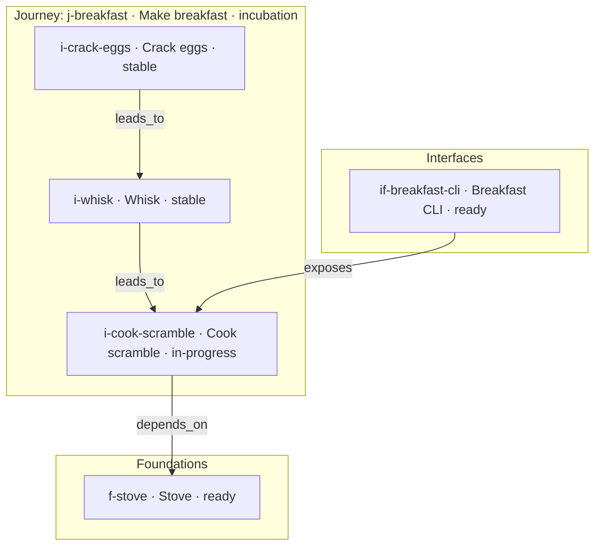

# MindPlan

**MindPlan is the persistent architectural model AI agents work from.**  
Agents cannot build correctly without knowing what the system *does*. MindPlan keeps that knowledge in the repo — Journeys, Interactions, Interfaces, Foundations, dependencies, and what is allowed to ship — so agents query a living model instead of guessing from tickets and chat.

Plan state lives next to the code. Every change to it is checked; illegal moves are rejected.

## The problem

Without a durable model of the product — what behaviors exist, how actors enter them, what substrate is ready — agents improvise from chat history and stale tickets. They ship over unfinished Foundations, wire entry surfaces to unfinished behaviors, or mark work done while checklists are still open.

External trackers list intent; they do not give agents a machine-queryable architecture, and nothing refuses an illegal move when the ticket says "ship."

## A plan that can refuse

MindPlan answers:

- What **is** this project — which capabilities, behaviors, and entry surfaces exist?
- What **can** be worked on next?
- Is this change **architecturally valid**?
- What will this **break** (dependents + Interaction reachability)?
- Is this feature even **allowed to ship**?

Every mutation is validated like a compile step:

```
Blocked: Infrastructure First. Interaction "i-checkout" cannot ship while
linked Foundations are not stable: "f-payments" (in-progress).
```

No ghost Interactions without a Journey and Foundation, no Interface ship while exposed Interactions are unfinished (**Behavior First**), no Interaction→Interaction `depends_on` (**Interaction Independence**), no review while Atomic Ops are unchecked.

## Plans are made to be changed

The compiler refuses *illegal* moves; it does not freeze the plan.

- **Rewire** — `link_nodes` / `unlink_nodes` (`belongs_to`, `depends_on`, `exposes`, `leads_to`, `affects`)
- **Retreat** — `in-review` → `in-progress` when scope or checklist reality changes
- **Evolve** — shipped Foundations/Interactions/Interfaces keep the same id; `open_next` → build on `next.mdx` → `ship` promotes over `current.mdx`
- **Retire** — production work to `deprecated` when intent is replaced (Journeys stay; only Bugs truly close)

## See what the agent sees

After every graph mutation, MindPlan refreshes [`mindplan/map.md`](mindplan/map.md) — Journeys, Interactions, Interfaces, Foundations, and Bugs. On demand: MCP `export_mindplan_view` or CLI `mindplan-mcp view`.

Today's map is an **architecture + state** projection. A richer status board is planned.

## Worked example: scrambled eggs

Capability, shared stove, behaviors, and how you start them:


```mermaid
flowchart TB
  subgraph jBreakfast ["Journey: j-breakfast · Make breakfast · incubation"]
    iCrack["i-crack-eggs · Crack eggs · stable"]
    iWhisk["i-whisk · Whisk · stable"]
    iCook["i-cook-scramble · Cook scramble · in-progress"]
  end
  subgraph foundations ["Foundations"]
    fStove["f-stove · Stove · ready"]
  end
  subgraph interfaces ["Interfaces"]
    ifCli["if-breakfast-cli · Breakfast CLI · ready"]
  end
  iCrack -->|"leads_to"| iWhisk
  iWhisk -->|"leads_to"| iCook
  iCook -->|"depends_on"| fStove
  ifCli -->|"exposes"| iCook
```

- **Journey** `j-breakfast` — permanent capability
- **Foundation** `f-stove` — shared substrate; cook cannot ship until the stove is `stable`
- **Interactions** — self-contained behaviors; they share state via Foundations, never `depends_on` each other. `leads_to` is navigation only (cycles allowed, not a ship gate)
- **Interface** `if-breakfast-cli` — how an actor starts cooking; ship needs exposed Interactions `stable` (**Behavior First**)

```
Blocked: Infrastructure First. Interaction "i-cook-scramble" cannot ship while
linked Foundations are not stable: "f-stove" (ready).
```

## How it's built

Territory under `mindplan/` (Journeys, Foundations, Interactions, Interfaces, Bugs) plus optional `next.mdx` while a shipped node evolves. By default, packages live at `src/interactions/<id>/`, `src/interfaces/<id>/`, and `src/foundations/<id>/` (`implementation_packages: "off"` for brownfield). An MCP server is the single write path.

- **[SPEC.md](SPEC.md)** — full framework specification
- **`src/`** — TypeScript MCP server (stdio)

## This repo's live plan

This repository dogfoods MindPlan. Live territory: [`mindplan/`](mindplan/). Map: [mindplan/map.md](mindplan/map.md).

## Who is this for

Built for people who ship **with AI agents** and need a living product architecture, not a stale ticket list. Best for indie developers and small teams where plan state is plain-text in git. Poor fit today for orgs that need multi-user permissions, audit trails, or sync with Jira/Linear.

## Quick start

**Not yet published to npm — install from source.**

1. Clone and build:

```bash
git clone https://github.com/nbiro/mindplan.git
cd mindplan
npm install && npm run build
```

2. From your project root, scaffold with the built server:

```bash
node /absolute/path/to/mindplan/dist/index.js init
```

`init` installs `.cursorignore`, `.cursor/permissions.json`, `mindplan/agent/` (playbook + skills), and `AGENTS.md` when missing.

3. Register the MCP server — see `mindplan/agent/integrations/` (or [templates/agent/integrations/README.md](templates/agent/integrations/README.md)).

4. Reload MCP servers after config changes.

## File system layout (consumer project)

```
<project-root>/
├── mindplan/
│   ├── agent/                     # playbook + skills (installed by init)
│   ├── journeys/<id>/
│   ├── foundations/<id>/          # + optional next.mdx
│   ├── interactions/<id>/         # + optional next.mdx
│   ├── interfaces/<id>/           # + optional next.mdx
│   └── bugs/<id>/
└── src/
    ├── interactions/<id>/
    ├── interfaces/<id>/
    └── foundations/<id>/
```

Edge arrays in frontmatter: `belongs_to`, `depends_on`, `exposes`, `leads_to`, `affects`. See SPEC.md §1–§2.

## Taxonomy

| Type | What it is | States |
|------|------------|--------|
| **Journey** | Domain capability the architecture screams | Computed (`draft`, `incubation`, `stable`, `evolving`) |
| **Interaction** | Self-contained behavior (any actor) — **not** a UI component | Build pipeline + `stable`/`unstable` |
| **Interface** | How an actor enters an Interaction (Page, CLI, MCP, Webhook, Cron, …) | Build pipeline + `stable`/`unstable` |
| **Foundation** | Shared substrate by role (Assembler, Infra, Design system, Adapter) | Build pipeline + `stable`/`unstable` |
| **Bug** | Defect on Interaction, Interface, or Foundation | `open → triaged → fixing → in-review → resolved \| wontfix` |

Journeys scream the domain · Interactions are behaviors · Interfaces are entry · Foundations are shared substrate · Assembler composes them.

**Build pipeline** (Foundation/Interaction/Interface): `draft → ready → in-progress → in-review → ship` → computed `stable`/`unstable`.

## Compiler Rules

Every violation starts with `Blocked: `.

1. **No Ghost Interactions** — need `belongs_to` + Foundation `depends_on` before `ready`/`in-progress`
2. **No Ghost Interfaces** — need `exposes` before `ready`/`in-progress`
3. **No Ghost Bugs** — need `affects` before `triaged`/`fixing`
4. **Infrastructure First** — Interaction `ship` needs all Foundation deps `stable`
5. **Behavior First** — Interface `ship` needs all exposed Interactions (and Foundation deps) `stable`
6. **Completion Check** — unchecked `[ ]` block `in-review`/`ship` (and Bug `resolved`)
7. **Interaction Independence** — no Interaction → Interaction `depends_on` (share state via Foundations)
8. **Computed Journeys / Stability** — never set manually
9. **Taxonomy** — legal edge shapes; `depends_on` acyclic; `leads_to` cycles allowed
10. **Next Evolution / Force Unship** — stable-id `open_next`; recovery only with explicit `confirm`

No Dependency Closure / `link_dependent`.

## MCP Tools

| Tool | Kind | Description |
|------|------|-------------|
| `orient_for_work` | read | find + context + blast radius (Interaction focus includes `reachability`) |
| `find_related_nodes` | read | Rank by query; focus + 1-hop |
| `get_mindplan_graph` | read | Assembled nodes/edges (`version: 1`) |
| `export_mindplan_view` | read | Mermaid or DOT |
| `get_blast_radius` | read | Reverse-`depends_on` affected + Interaction reachability |
| `get_node_context` | read | `record` + `body` (+ `next` when evolving) |
| `get_node_implementation` | read | Package root for Interaction/Interface/Foundation |
| `patch_node_territory` | mutation | Optional prose fallback; prefer host file tools |
| `create_node` | mutation | Journey, Foundation, Interaction, Interface, or Bug |
| `open_next` / `discard_next` | mutation | Evolve / abandon shipped node in place |
| `link_nodes` / `unlink_nodes` | mutation | Five edge types; no `link_dependent` |
| `update_node_status` | mutation | Pipeline + `ship` (promotes `next` when open) |
| `force_unship` | mutation | Mistaken-ship recovery (`confirm: "unship:<id>"`) |

## CLI

| Command | Description |
|---------|-------------|
| `mindplan-mcp` | Start MCP server (stdio) |
| `mindplan-mcp init` | Scaffold territory + agent assets |
| `mindplan-mcp view` | Print Mermaid/DOT (`export` alias) |
| `mindplan-mcp check` | Offline integrity; `--for-main` merge gate |
| `mindplan-mcp help` | Usage |

Set `MINDPLAN_ROOT` to override the project root (default `process.cwd()`).

## Development

See [CONTRIBUTING.md](CONTRIBUTING.md).

```bash
npm install
npm run build
npm test
```

## License

[MIT](LICENSE)
