# The mindplan for mindplan

Live projection of this repository's MindPlan territory (`mindplan/`). Regenerate with:

```bash
node dist/index.js view --format mermaid --output mindplan-map.md
```

Then wrap the CLI output in a Mermaid fence (or keep this committed snapshot).

```mermaid
flowchart TB
  subgraph foundations["Foundations"]
    f_compiler_rules["f-compiler-rules · Compiler rules engine · stable"]
    f_domain_model["f-domain-model · Domain model · stable"]
    f_mcp_runtime["f-mcp-runtime · MCP stdio runtime · stable"]
    f_territory_store["f-territory-store · Territory filesystem store · stable"]
  end
  subgraph journey_j_agent_onboarding["j-agent-onboarding · Agent onboarding · stable"]
    wf_agent_integrations__in__j_agent_onboarding["wf-agent-integrations · Agent integrations · stable"]
    wf_framework_docs__in__j_agent_onboarding["wf-framework-docs · Framework documentation · stable"]
    wf_npm_publish__in__j_agent_onboarding["wf-npm-publish · Publish to npm · draft"]
    wf_project_init__in__j_agent_onboarding["wf-project-init · Project init · stable"]
  end
  subgraph journey_j_territory_sdlc["j-territory-sdlc · Territory SDLC · stable"]
    wf_export_views__in__j_territory_sdlc["wf-export-views · Export graph views · stable"]
    wf_framework_docs__in__j_territory_sdlc["wf-framework-docs · Framework documentation · stable"]
    wf_mutate_graph__in__j_territory_sdlc["wf-mutate-graph · Mutate graph · stable"]
    wf_query_graph__in__j_territory_sdlc["wf-query-graph · Query graph · stable"]
    wf_test_harness__in__j_territory_sdlc["wf-test-harness · Test harness · stable"]
  end
  f_compiler_rules --> f_domain_model
  f_mcp_runtime --> f_compiler_rules
  f_mcp_runtime --> f_territory_store
  f_territory_store --> f_domain_model
  wf_agent_integrations__in__j_agent_onboarding --> f_mcp_runtime
  wf_export_views__in__j_territory_sdlc --> f_mcp_runtime
  wf_export_views__in__j_territory_sdlc --> f_territory_store
  wf_framework_docs__in__j_agent_onboarding --> f_domain_model
  wf_framework_docs__in__j_territory_sdlc --> f_domain_model
  wf_mutate_graph__in__j_territory_sdlc --> f_compiler_rules
  wf_mutate_graph__in__j_territory_sdlc --> f_mcp_runtime
  wf_npm_publish__in__j_agent_onboarding --> f_mcp_runtime
  wf_project_init__in__j_agent_onboarding --> f_territory_store
  wf_query_graph__in__j_territory_sdlc --> f_mcp_runtime
  wf_test_harness__in__j_territory_sdlc --> f_mcp_runtime
```


