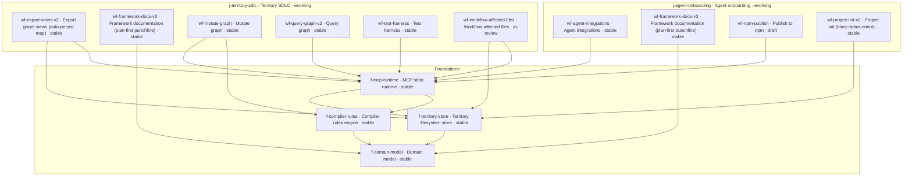

# MindPlan map

_Auto-generated after each graph mutation (15 nodes, 26 edges). Do not edit by hand._

```mermaid
flowchart TB
  subgraph foundations["Foundations"]
    f_compiler_rules["f-compiler-rules · Compiler rules engine · stable"]
    f_domain_model["f-domain-model · Domain model · stable"]
    f_mcp_runtime["f-mcp-runtime · MCP stdio runtime · stable"]
    f_territory_store["f-territory-store · Territory filesystem store · stable"]
  end
  subgraph journey_j_agent_onboarding["j-agent-onboarding · Agent onboarding · evolving"]
    wf_agent_integrations__in__j_agent_onboarding["wf-agent-integrations · Agent integrations · stable"]
    wf_framework_docs_v3__in__j_agent_onboarding["wf-framework-docs-v3 · Framework documentation (plan-first punchline) · stable"]
    wf_npm_publish__in__j_agent_onboarding["wf-npm-publish · Publish to npm · draft"]
    wf_project_init_v2__in__j_agent_onboarding["wf-project-init-v2 · Project init (blast-radius orient) · stable"]
  end
  subgraph journey_j_territory_sdlc["j-territory-sdlc · Territory SDLC · evolving"]
    wf_export_views_v2__in__j_territory_sdlc["wf-export-views-v2 · Export graph views (auto-persist map) · stable"]
    wf_framework_docs_v3__in__j_territory_sdlc["wf-framework-docs-v3 · Framework documentation (plan-first punchline) · stable"]
    wf_mutate_graph__in__j_territory_sdlc["wf-mutate-graph · Mutate graph · stable"]
    wf_query_graph_v2__in__j_territory_sdlc["wf-query-graph-v2 · Query graph · stable"]
    wf_test_harness__in__j_territory_sdlc["wf-test-harness · Test harness · stable"]
    wf_workflow_affected_files__in__j_territory_sdlc["wf-workflow-affected-files · Workflow affected files · in-review"]
  end
  f_compiler_rules --> f_domain_model
  f_mcp_runtime --> f_compiler_rules
  f_mcp_runtime --> f_territory_store
  f_territory_store --> f_domain_model
  wf_agent_integrations__in__j_agent_onboarding --> f_mcp_runtime
  wf_export_views_v2__in__j_territory_sdlc --> f_mcp_runtime
  wf_export_views_v2__in__j_territory_sdlc --> f_territory_store
  wf_framework_docs_v3__in__j_agent_onboarding --> f_domain_model
  wf_framework_docs_v3__in__j_territory_sdlc --> f_domain_model
  wf_mutate_graph__in__j_territory_sdlc --> f_compiler_rules
  wf_mutate_graph__in__j_territory_sdlc --> f_mcp_runtime
  wf_npm_publish__in__j_agent_onboarding --> f_mcp_runtime
  wf_project_init_v2__in__j_agent_onboarding --> f_territory_store
  wf_query_graph_v2__in__j_territory_sdlc --> f_mcp_runtime
  wf_test_harness__in__j_territory_sdlc --> f_mcp_runtime
  wf_workflow_affected_files__in__j_territory_sdlc --> f_mcp_runtime
  wf_workflow_affected_files__in__j_territory_sdlc --> f_territory_store
```
