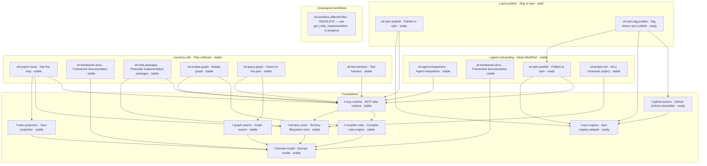

# MindPlan map

_Auto-generated after each graph mutation (22 nodes, 37 edges). Do not edit by hand._

```mermaid
flowchart TB
  subgraph foundations["Foundations"]
    f_compiler_rules["f-compiler-rules · Compiler rules engine · stable"]
    f_domain_model["f-domain-model · Domain model · stable"]
    f_github_actions["f-github-actions · GitHub Actions assembler · ready"]
    f_graph_search["f-graph-search · Graph search · stable"]
    f_mcp_runtime["f-mcp-runtime · MCP stdio runtime · stable"]
    f_npm_registry["f-npm-registry · npm registry adapter · ready"]
    f_territory_store["f-territory-store · Territory filesystem store · stable"]
    f_view_projection["f-view-projection · View projection · stable"]
  end
  subgraph journey_j_agent_onboarding["j-agent-onboarding · Adopt MindPlan · stable"]
    wf_agent_integrations__in__j_agent_onboarding["wf-agent-integrations · Agent integrations · stable"]
    wf_framework_docs__in__j_agent_onboarding["wf-framework-docs · Framework documentation · stable"]
    wf_npm_publish__in__j_agent_onboarding["wf-npm-publish · Publish to npm · ready"]
    wf_project_init__in__j_agent_onboarding["wf-project-init · Init a consumer project · stable"]
  end
  subgraph journey_j_npm_publish["j-npm-publish · Ship to npm · draft"]
    wf_npm_publish__in__j_npm_publish["wf-npm-publish · Publish to npm · ready"]
    wf_npm_tag_publish__in__j_npm_publish["wf-npm-tag-publish · Tag-driven npm publish · ready"]
  end
  subgraph journey_j_territory_sdlc["j-territory-sdlc · Plan software · stable"]
    wf_export_views__in__j_territory_sdlc["wf-export-views · See the map · stable"]
    wf_framework_docs__in__j_territory_sdlc["wf-framework-docs · Framework documentation · stable"]
    wf_impl_packages__in__j_territory_sdlc["wf-impl-packages · Prescribe implementation packages · stable"]
    wf_mutate_graph__in__j_territory_sdlc["wf-mutate-graph · Mutate graph · stable"]
    wf_query_graph__in__j_territory_sdlc["wf-query-graph · Orient on the plan · stable"]
    wf_test_harness__in__j_territory_sdlc["wf-test-harness · Test harness · stable"]
  end
  subgraph unassigned["Unassigned workflows"]
    wf_workflow_affected_files["wf-workflow-affected-files · OBSOLETE — use get_node_implementation · in-progress"]
  end
  f_compiler_rules --> f_domain_model
  f_github_actions --> f_npm_registry
  f_graph_search --> f_domain_model
  f_mcp_runtime --> f_compiler_rules
  f_mcp_runtime --> f_territory_store
  f_territory_store --> f_domain_model
  f_view_projection --> f_domain_model
  wf_agent_integrations__in__j_agent_onboarding --> f_mcp_runtime
  wf_export_views__in__j_territory_sdlc --> f_mcp_runtime
  wf_export_views__in__j_territory_sdlc --> f_territory_store
  wf_export_views__in__j_territory_sdlc --> f_view_projection
  wf_framework_docs__in__j_agent_onboarding --> f_domain_model
  wf_framework_docs__in__j_territory_sdlc --> f_domain_model
  wf_impl_packages__in__j_territory_sdlc --> f_mcp_runtime
  wf_impl_packages__in__j_territory_sdlc --> f_territory_store
  wf_mutate_graph__in__j_territory_sdlc --> f_compiler_rules
  wf_mutate_graph__in__j_territory_sdlc --> f_mcp_runtime
  wf_npm_publish__in__j_agent_onboarding --> f_mcp_runtime
  wf_npm_publish__in__j_npm_publish --> f_mcp_runtime
  wf_npm_publish__in__j_agent_onboarding --> f_npm_registry
  wf_npm_publish__in__j_npm_publish --> f_npm_registry
  wf_npm_tag_publish__in__j_npm_publish --> f_github_actions
  wf_npm_tag_publish__in__j_npm_publish --> f_npm_registry
  wf_npm_tag_publish__in__j_npm_publish --> wf_npm_publish__in__j_agent_onboarding
  wf_project_init__in__j_agent_onboarding --> f_territory_store
  wf_query_graph__in__j_territory_sdlc --> f_graph_search
  wf_query_graph__in__j_territory_sdlc --> f_mcp_runtime
  wf_test_harness__in__j_territory_sdlc --> f_mcp_runtime
```
