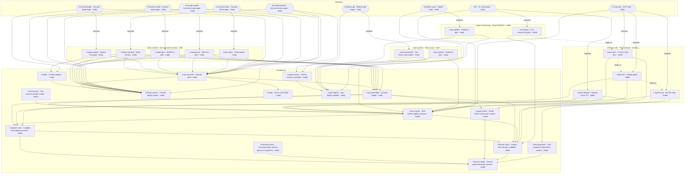

# MindPlan map

_Auto-generated after each graph mutation (40 nodes, 91 edges). Do not edit by hand._

```mermaid
flowchart TB
  subgraph foundations["Foundations"]
    f_compiler_rules["f-compiler-rules · Compiler rules (lighter process) · stable"]
    f_console_bridge["f-console-bridge · Console bridge · ready"]
    f_console_shell["f-console-shell · Console shell · ready"]
    f_design_system["f-design-system · Console design system · ready"]
    f_domain_model["f-domain-model · Domain model (interaction-centric) · stable"]
    f_framework_docs["f-framework-docs · Framework docs (review ignores in-progress) · stable"]
    f_github_actions["f-github-actions · GitHub Actions assembler · stable"]
    f_graph_search["f-graph-search · Graph search (interaction-centric) · stable"]
    f_mcp_runtime["f-mcp-runtime · MCP runtime (lighter process) · stable"]
    f_nextjs["f-nextjs · Next.js assembler · ready"]
    f_npm_registry["f-npm-registry · npm registry adapter · ready"]
    f_territory_store["f-territory-store · Territory store (shape scaffolds) · stable"]
    f_test_harness["f-test-harness · Test harness (shape smoke) · stable"]
    f_view_projection["f-view-projection · View projection (interaction-centric) · stable"]
    f_xyflow["f-xyflow · XYFlow adapter · ready"]
  end
  subgraph interfaces["Interfaces"]
    if_cli{{"if-cli · CLI commands · ready"}}
    if_console_graph{{"if-console-graph · Console graph page · ready"}}
    if_console_model{{"if-console-model · Console model page · ready"}}
    if_console_mutate{{"if-console-mutate · Console mutate page · ready"}}
    if_console_status{{"if-console-status · Console status page · ready"}}
    if_console_territory{{"if-console-territory · Console territory page · ready"}}
    if_mcp_tools{{"if-mcp-tools · MCP tools · ready"}}
    if_publish_script{{"if-publish-script · Publish script · ready"}}
    if_release_tag{{"if-release-tag · Release tag trigger · ready"}}
  end
  subgraph journey_j_agent_onboarding["j-agent-onboarding · Adopt MindPlan · stable"]
    i_init_project__in__j_agent_onboarding["i-init-project · Init a consumer project · stable"]
    i_npm_publish__in__j_agent_onboarding["i-npm-publish · Publish to npm · ready"]
  end
  subgraph journey_j_npm_publish["j-npm-publish · Ship to npm · draft"]
    i_npm_publish__in__j_npm_publish["i-npm-publish · Publish to npm · ready"]
    i_npm_tag_publish__in__j_npm_publish["i-npm-tag-publish · Tag-driven npm publish · ready"]
  end
  subgraph journey_j_plan_console["j-plan-console · See and steer the plan · draft"]
    i_browse_territory__in__j_plan_console["i-browse-territory · Read territory · ready"]
    i_explore_graph__in__j_plan_console["i-explore-graph · Explore the graph · ready"]
    i_model_plan__in__j_plan_console["i-model-plan · Model the plan · ready"]
    i_mutate_plan__in__j_plan_console["i-mutate-plan · Steer the plan · ready"]
    i_view_status__in__j_plan_console["i-view-status · Status board · ready"]
  end
  subgraph journey_j_territory_sdlc["j-territory-sdlc · Plan software · evolving"]
    i_check_integrity__in__j_territory_sdlc["i-check-integrity · Integrity check CLI · stable"]
    i_export_map__in__j_territory_sdlc["i-export-map · See the map · stable"]
    i_orient_plan__in__j_territory_sdlc["i-orient-plan · Orient on the plan · stable"]
    i_steer_plan__in__j_territory_sdlc["i-steer-plan · Mutate graph · stable"]
  end
  f_compiler_rules --> f_domain_model
  f_compiler_rules --> f_territory_store
  f_console_bridge --> f_compiler_rules
  f_console_bridge --> f_graph_search
  f_console_bridge --> f_mcp_runtime
  f_console_bridge --> f_territory_store
  f_console_shell --> f_console_bridge
  f_console_shell --> f_design_system
  f_console_shell --> f_nextjs
  f_framework_docs --> f_domain_model
  f_github_actions --> f_npm_registry
  f_graph_search --> f_domain_model
  f_mcp_runtime --> f_compiler_rules
  f_mcp_runtime --> f_territory_store
  f_territory_store --> f_domain_model
  f_test_harness --> f_mcp_runtime
  f_view_projection --> f_domain_model
  f_xyflow --> f_design_system
  i_browse_territory__in__j_plan_console --> f_console_bridge
  i_browse_territory__in__j_plan_console --> f_console_shell
  i_browse_territory__in__j_plan_console --> f_design_system
  i_check_integrity__in__j_territory_sdlc --> f_compiler_rules
  i_check_integrity__in__j_territory_sdlc --> f_mcp_runtime
  i_check_integrity__in__j_territory_sdlc --> f_territory_store
  i_explore_graph__in__j_plan_console --> f_console_bridge
  i_explore_graph__in__j_plan_console --> f_console_shell
  i_explore_graph__in__j_plan_console --> f_design_system
  i_explore_graph__in__j_plan_console --> f_xyflow
  i_export_map__in__j_territory_sdlc --> f_mcp_runtime
  i_export_map__in__j_territory_sdlc --> f_territory_store
  i_export_map__in__j_territory_sdlc --> f_view_projection
  i_init_project__in__j_agent_onboarding --> f_territory_store
  i_init_project__in__j_agent_onboarding -.->|leads_to| i_orient_plan__in__j_territory_sdlc
  i_model_plan__in__j_plan_console --> f_console_bridge
  i_model_plan__in__j_plan_console --> f_console_shell
  i_model_plan__in__j_plan_console --> f_design_system
  i_mutate_plan__in__j_plan_console --> f_console_bridge
  i_mutate_plan__in__j_plan_console --> f_console_shell
  i_mutate_plan__in__j_plan_console --> f_design_system
  i_npm_publish__in__j_agent_onboarding --> f_mcp_runtime
  i_npm_publish__in__j_npm_publish --> f_mcp_runtime
  i_npm_publish__in__j_agent_onboarding --> f_npm_registry
  i_npm_publish__in__j_npm_publish --> f_npm_registry
  i_npm_tag_publish__in__j_npm_publish --> f_github_actions
  i_npm_tag_publish__in__j_npm_publish --> f_npm_registry
  i_orient_plan__in__j_territory_sdlc --> f_graph_search
  i_orient_plan__in__j_territory_sdlc --> f_mcp_runtime
  i_orient_plan__in__j_territory_sdlc -.->|leads_to| i_steer_plan__in__j_territory_sdlc
  i_steer_plan__in__j_territory_sdlc --> f_compiler_rules
  i_steer_plan__in__j_territory_sdlc --> f_mcp_runtime
  i_steer_plan__in__j_territory_sdlc -.->|leads_to| i_export_map__in__j_territory_sdlc
  i_view_status__in__j_plan_console --> f_console_bridge
  i_view_status__in__j_plan_console --> f_console_shell
  i_view_status__in__j_plan_console --> f_design_system
  if_cli --> f_mcp_runtime
  if_cli -->|exposes| i_check_integrity__in__j_territory_sdlc
  if_cli -->|exposes| i_init_project__in__j_agent_onboarding
  if_console_graph --> f_console_shell
  if_console_graph --> f_xyflow
  if_console_graph -->|exposes| i_explore_graph__in__j_plan_console
  if_console_model --> f_console_shell
  if_console_model --> f_design_system
  if_console_model -->|exposes| i_model_plan__in__j_plan_console
  if_console_mutate --> f_console_shell
  if_console_mutate --> f_design_system
  if_console_mutate -->|exposes| i_mutate_plan__in__j_plan_console
  if_console_status --> f_console_shell
  if_console_status --> f_design_system
  if_console_status -->|exposes| i_view_status__in__j_plan_console
  if_console_territory --> f_console_shell
  if_console_territory --> f_design_system
  if_console_territory -->|exposes| i_browse_territory__in__j_plan_console
  if_mcp_tools --> f_mcp_runtime
  if_mcp_tools -->|exposes| i_export_map__in__j_territory_sdlc
  if_mcp_tools -->|exposes| i_orient_plan__in__j_territory_sdlc
  if_mcp_tools -->|exposes| i_steer_plan__in__j_territory_sdlc
  if_publish_script --> f_npm_registry
  if_publish_script -->|exposes| i_npm_publish__in__j_agent_onboarding
  if_release_tag --> f_github_actions
  if_release_tag -->|exposes| i_npm_tag_publish__in__j_npm_publish
```
